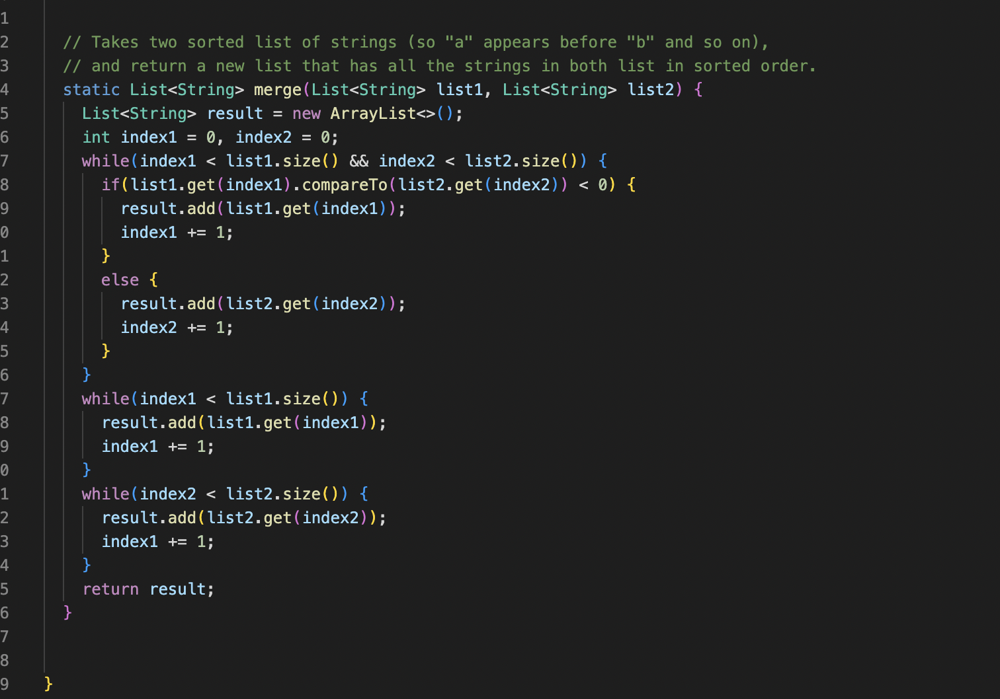
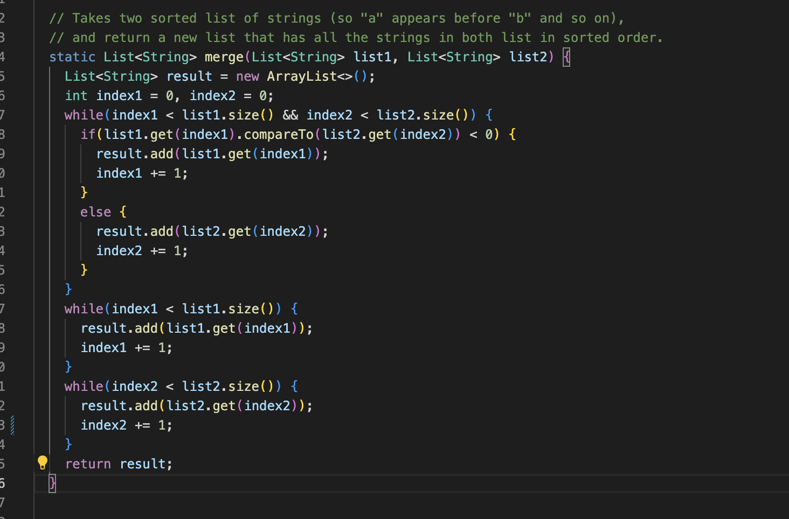

# Part one

## Code of the simpest search engine

```

import java.net.URI;
import java.util.ArrayList;
import java.io.IOException;

class Handler implements URLHandler {
    // The one bit of state on the server: a number that will be manipulated by
    // various requests.
    String  inputs ="";
    ArrayList<String> another_inputs= new ArrayList<>();
    ArrayList<String> result= new ArrayList<>();


    public String handleRequest(URI url) {
        
        if (url.getPath().contains("add")){
            String[] things_useful = url.getQuery().split("=");
            another_inputs.add(things_useful[1]);
            String need_to_return = String.format("String added: %s", things_useful[1]);
            return need_to_return;
            
        } else if (url.getPath().contains("search")){
            String[] things_useful = url.getQuery().split("=");
            String exists = things_useful[1];
            String result_to_return = "";
            for(String s: another_inputs){
                
                    result_to_return += s + " "; 
                
            }
            return result_to_return; 
               
        }
        else{
            return "404 Not Found!";
        }
    }
}


class SearchEngine {
    public static void main(String[] args) throws IOException {
        if(args.length == 0){
            System.out.println("Missing port number! Try any number between 1024 to 49151");
            return;
        }

        int port = Integer.parseInt(args[0]);

        Server.start(port, new Handler());
    }
}
```

## Screenshots one


### Method called, relevent argument 
heandlRequested, the 'else' statement. This is becasue the URL doesn't contain anything excpt the value we give to create the local host. Which means the two 'if' statement will not be runed and the webpage will only tell us that '404 not found'


## Screenshot two


### Method called, relevent argument 
headRequested, the first 'if' statement is used. We can see that the url contains the add and there is some words after the  question mark. What I did is change the words before and after the equal marks into two element in a list called "useful_element". I created a new list called 'another_input' to store the element we need, in this case, the element we add, which is the element after the equal sign, useful_element[1]. Once the new URL is input and it contains "add", the method will help us to sotre the element after the euqal sign into "another_input" and print a sentences which tell the use that "String added:..." where ... is the element after the equal sign. 


## Screenshot three
![Image]./Screen%20Shot%202022-10-27%20at%2010.20.47%20PM.png)
### Method called, relevent argument 
headRequested, the second 'if' statement is used. This URL contains 'search', it means that the second if satement will be called because we use contain() method to test if there is a "search' string in the input and return a boolean. After .contain() method return true, we use the same method to split the element after the equal sign and use the element after the equal sign and the for loop to run throught the whole list "another_input" we created before. If there is a element in the list that equal to the element we need, we will creat a  string that contains every element we have added into another input and return it on the screen. 

# Part two

## Firstbug
### Image of the test code
 
### image of the originol code


### sympton and bug
the sympton of the buggy method is that it does not change the list into the inverse form but return a list full of zero, this is becasue when the method try to copy the content by using the for loop, the list tit trys to copy this the one that just created, all of the lement in this list is zero. What I did is that I just replace the new Arraylist into thew orginal one, assign each element into the one the just created, which can perfectly solve this probelem
### Improved code
```
Improved code for reversed
static int[] reversed(int[] arr) {
    int[] newArray = new int[arr.length];
    for(int i = 0; i < arr.length; i += 1) {
      newArray[i] = arr[arr.length - i - 1];
    }
    return newArray;
  }
```

## Second bug
### Image of the test code

### Image of the original code

### sympton and bug
the sympton of this method is that it does not merge two input list but continuelly run the test until the storage used up or just return the first input list, this is because in the second while loop, the code is continually comparing the index1 and the size of the second list, which means if the while loop will stop does not related to any other things but the index1, but index does not do any change in this loop. To fix this problem. we can just change index1 into index2. 

### Image of improved code

